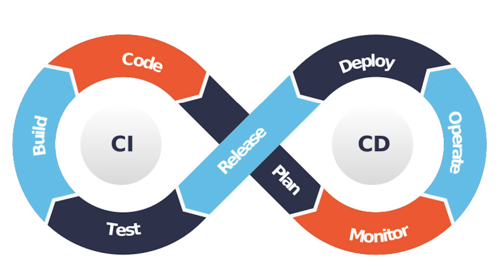

## ⚙️ 1. Initial Configuration

Set your identity before using Git:

```bash
git config --global user.name "Your Name"
git config --global user.email "you@example.com"
```
## ✅ 4. Commit Changes

Commit staged files with a message:

```bash
git commit -m "Your commit message here"
```

---


## Git Workflow

Below is the Git workflow diagram:

